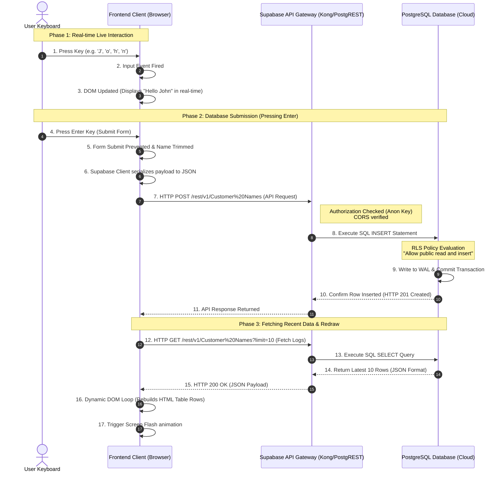

# End-to-End Data Journey: From Keystroke to Cloud Database and Back

This document details the complete path of data as it travels from your physical keyboard, through the web application frontend, across the internet, into the Supabase cloud infrastructure, down to the PostgreSQL database, and finally back to the frontend screen.

---

## 🗺️ System Architecture (Connecting the Dots)

Before diving into individual components, here is a high-level visual representation of how traffic flows. 



---

## 🖥️ Document 1: The Frontend (Client-Side Interface)

The frontend acts as the interface, transforming physical user interaction into digital data objects and rendering raw database payloads into a styled UI.

### 1. Keystroke Capture (The `input` Event)
When you press a key on your keyboard inside the input box, the operating system registers a key event and notifies the browser.
* **Component**: HTML `<input id="user-name">` element.
* **Event Listener**: A JavaScript event handler listens for the `input` event on this element.
* **Logic**: As you type, the listener immediately reads the input's current value (`e.target.value`).
* **Visual update**: JavaScript updates the text content of the greeting element (`#displayed-name`) in real time. If the input becomes empty, the script resets the text back to `"Guest"`. No database traffic occurs during simple typing to optimize performance and prevent API rate-limiting.

### 2. Form Submission (The `submit` Event)
When you press **Enter** (or submit the form), a separate process triggers to save the data permanently.
* **Component**: HTML `<form id="greeting-form">`.
* **Logic**: The submit event listener blocks the browser's default behavior (which would normally reload the page) using `e.preventDefault()`.
* **Trimming**: The script cleans the text value, removing leading or trailing spaces using `.trim()`. If the input is not empty, it proceeds to trigger the async database call `saveName(cleanedName)`.

### 3. Client Serialization & Networking
* **Library**: The Supabase JavaScript Client Library (`@supabase/supabase-js`).
* **Serialization**: The client library converts the plain string name into a JSON payload structure:
  ```json
  [ { "Name": "John" } ]
  ```
* **Transport**: The client library initiates an asynchronous HTTP `POST` request using the browser's native `fetch` API. It appends the project's public `anon` API key to the request headers (`apikey` and `Authorization: Bearer <key>`) to authenticate itself to the Supabase gateway.

### 4. Response & Redraw
Once the API responds confirming success:
* **Flash Effect**: The frontend changes the background color of the virtual monitor screen to white briefly, then fades it out to give visual tactile feedback.
* **Fetch Call**: The script automatically executes `loadLogs()`, which sends a `GET` request to fetch the 10 most recent rows.
* **DOM Construction**: The script clears the existing table lines in `#db-entries-list` and loops through the returned database array. For each record, it creates a new `<tr>` row containing the ID, the escaped name (using HTML entity encoding to prevent Cross-Site Scripting (XSS)), and the formatted locale timestamp.

---

## ⚡ Document 2: The Backend (Supabase API Gateway)

Supabase is a Backend-as-a-Service (BaaS) platform. The "backend" consists of a preconfigured containerized stack running in the cloud.

```
       [ HTTP API Request ]
                │
                ▼
      ┌──────────────────┐
      │ Kong API Gateway │  (Auth, Rate Limiting, CORS)
      └────────┬─────────┘
               │
               ▼
      ┌──────────────────┐
      │     PostgREST    │  (Translates HTTP REST endpoints into SQL)
      └────────┬─────────┘
               │
               ▼
   [ PostgreSQL Database Server ]
```

### 1. Kong API Gateway (Reverse Proxy)
All incoming network traffic targeted at your database URL (`https://tibxvvjsgkyurxepdnsh.supabase.co`) first hits **Kong**, an open-source Cloud-Native API Gateway.
* **CORS Verification**: Kong checks the request headers to ensure they comply with Cross-Origin Resource Sharing (CORS) rules, allowing browser calls to proceed.
* **Authentication**: Kong inspects the `Authorization` header containing the JWT (JSON Web Token) anon key. It validates the signature of the token to verify it came from your project.

### 2. PostgREST (The REST-to-SQL Translator)
Once Kong authorizes the request, it passes the payload to **PostgREST**, a web server that reads your PostgreSQL schema and automatically generates a RESTful API.
* **Parsing the URL**: PostgREST inspects the endpoint:
  * `POST /rest/v1/Customer%20Names` tells it to write data into the `Customer Names` table.
  * `GET /rest/v1/Customer%20Names?limit=10&order=created_at.desc` tells it to read data.
* **SQL Translation**: PostgREST translates the JSON payload and the HTTP headers into an optimized SQL command:
  ```sql
  INSERT INTO public."Customer Names" ("Name") VALUES ('John');
  ```
* **Execution**: It opens a connection pool in the database and executes the generated SQL statement within a secure PostgreSQL transaction.

---

## 💾 Document 3: The Database (PostgreSQL Engine)

At the core of the system sits **PostgreSQL**, a robust relational database engine running inside a secure virtual environment.

### 1. Row Level Security (RLS) Filter
Before PostgreSQL executes the SQL command received from PostgREST, it runs it through the database security filter.
* **Policy Check**: The database looks up active RLS policies on the table `"public"."Customer Names"`.
* **Policy Name**: `Allow public read and insert`
* **Rule**:
  ```sql
  FOR ALL TO public USING (true) WITH CHECK (true);
  ```
* **Evaluation**: Because the user connected using the `anon` (public) role, and the policy checks evaluate to `true` (unconditional access), the database permits the operation to proceed. If RLS was enabled but no policy was defined, the operation would instantly fail with an authorization error.

### 2. Transaction Log & Write-Ahead Logging (WAL)
* **Write to WAL**: The database first appends the insert transaction sequentially to the **Write-Ahead Log (WAL)** on the disk. This ensures durability (even if the server suddenly loses power, the transaction can be restored).
* **Memory Buffer**: The database updates the indexes and data pages inside its RAM buffer cache.

### 3. Disk Commit & Auto-Generation
* **System Columns**: The database automatically populates the table's default columns:
  * `id`: Generates the next sequential number (e.g. `2`, `3`, `4`) using the primary key sequencer.
  * `created_at`: Records the precise server time using PostgreSQL's `now()` function.
* **Disk Write**: The transaction commits, and PostgreSQL returns a success status row back to PostgREST.

---

## 📡 Document 4: Traffic Flow & Data Formats

Below is a breakdown of the specific data packages and headers that travel over the network at each key junction.

### 1. Data Package: Submitting a Name (Frontend $\rightarrow$ Gateway)
* **Protocol**: HTTPS (Port 443, TLS 1.3 encrypted)
* **Method & Path**: `POST https://tibxvvjsgkyurxepdnsh.supabase.co/rest/v1/Customer%20Names`
* **Important Headers**:
  ```http
  Content-Type: application/json
  apikey: eyJhbGciOiJIUzI1...
  Authorization: Bearer eyJhbGciOiJIUzI1...
  Prefer: return=representation
  ```
* **JSON Payload**:
  ```json
  [{"Name":"John"}]
  ```

### 2. Data Package: Gateway Response (Gateway $\rightarrow$ Frontend)
* **Protocol**: HTTPS
* **Status Code**: `201 Created`
* **JSON Payload returned**:
  ```json
  [
    {
      "id": 14,
      "created_at": "2026-08-25T11:02:14.123Z",
      "Name": "John"
    }
  ]
  ```

### 3. Data Package: Loading Logs (Frontend $\leftrightarrow$ Gateway)
* **Protocol**: HTTPS
* **Method & Path**: `GET https://tibxvvjsgkyurxepdnsh.supabase.co/rest/v1/Customer%20Names?select=*&order=created_at.desc&limit=10`
* **Response Status**: `200 OK`
* **JSON Payload returned (Array of logs)**:
  ```json
  [
    {"id": 14, "created_at": "2026-08-25T11:02:14.123Z", "Name": "John"},
    {"id": 13, "created_at": "2026-08-25T10:48:02.581Z", "Name": "Kelvin"},
    {"id": 12, "created_at": "2026-08-25T10:45:11.902Z", "Name": "Daniel"}
  ]
  ```
