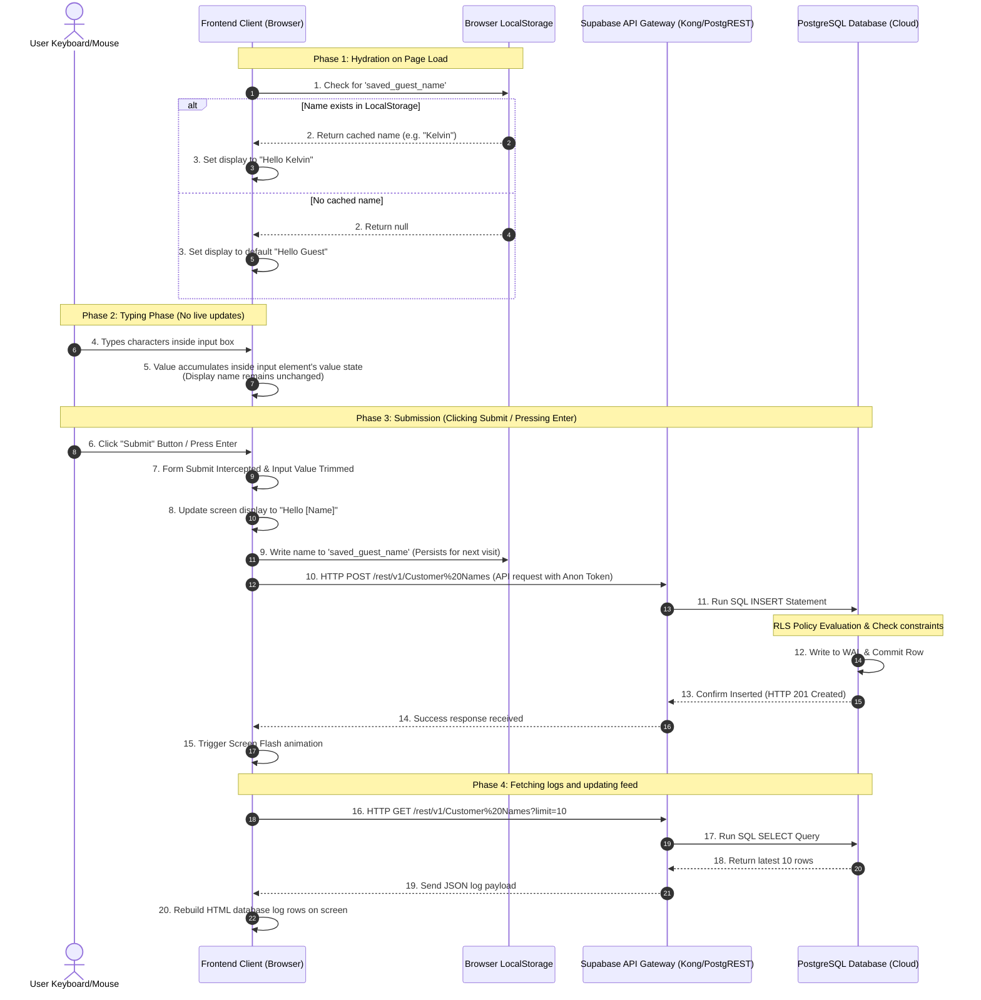

# End-to-End Data Journey: From Keystroke to Persistent Storage and Cloud Database

This document details the updated data path of the AuraGreet application, outlining how names are processed, saved to a cloud database, cached in the browser's local storage, and restored upon subsequent visits.

---

## 🗺️ System Architecture (Connecting the Dots)

Below is the updated sequence flow showing how data is cached locally on load, held during typing, and saved both to `localStorage` and Supabase upon clicking **Submit**.



---

## 🖥️ Section 1: The Frontend (Client-Side State & Controls)

The client side orchestrates the interface, state management, and network calls.

### 1. State Hydration (Page Load)
* **Mechanic**: When the page finishes loading, the `DOMContentLoaded` event fires.
* **Storage Check**: The script queries the browser's persistent cache:
  ```javascript
  const savedName = localStorage.getItem('saved_guest_name');
  ```
* **State Selection**:
  * If `savedName` is found, the screen immediately renders `"Hello [savedName]"`.
  * If no name is saved, it renders the default `"Hello Guest"`.
* **Database Fetch**: It queries the database logs simultaneously, loading the recent activity feed.

### 2. Typing (Input Buffering)
Unlike the previous version which updated the screen live on every keystroke, the input field now acts as an **isolated buffer**.
* **Keystrokes**: Characters accumulate within the HTML `<input>` element's internal state.
* **No Side-Effects**: The display header `"Hello [Name]"` is unaffected during this time, avoiding flashing/unfinished text states.

### 3. Submission (The Submit Button & Keyboard Enter)
Clicking the new `.terminal-submit-btn` or pressing Enter triggers the `submit` event:
1. **Event Capture**: The form listener intercepts the submission and disables page reloads via `e.preventDefault()`.
2. **API Call**: The Supabase client packages the data and fires an asynchronous HTTP `POST` request to the database. The client appends `.select()` to the query, requesting that the database engine return the newly written row back.
3. **Database Retrieval**: Upon receiving a success response, the script extracts the exact string saved under the column `"Name"` directly from the database response payload.
4. **Screen Print**: The visual welcome text is updated with the returned database string, verifying that the data completed the cloud round-trip.
5. **Local Caching**: The script saves the database-verified name to `localStorage` to remember the guest:
   ```javascript
   localStorage.setItem('saved_guest_name', nameFromDB);
   ```
6. **Flash FX**: The screen runs a flash animation to signal the database write was completed.

---

## ⚡ Section 2: Backend API Gateway

Since the app is serverless on the frontend, it relies on Supabase’s preconfigured backend gateway:

1. **Kong API Gateway**: Receives the HTTPS request. It checks for cross-origin permissions (CORS) and decodes the JWT API keys.
2. **PostgREST Translation Engine**: Automatically maps the HTTP REST endpoint into standard SQL queries.
   * **Endpoint**: `POST https://your-project-id.supabase.co/rest/v1/Customer%20Names`
   * **SQL Command**:
     ```sql
     INSERT INTO public."Customer Names" ("Name") VALUES ('TypedName');
     ```

---

## 💾 Section 3: Cloud Database (PostgreSQL Engine)

PostgreSQL executes the operations while enforcing safety policies:

1. **Row Level Security (RLS) Filter**: The database evaluates the active RLS policy.
   * **Policies**:
     * `SELECT`: Enabled for public roles (`USING (true)`).
     * `INSERT`: Enabled for public roles (`WITH CHECK (true)`).
     * `DELETE / UPDATE`: Blocked (no policy exists, ensuring database records are permanent and cannot be deleted by clients).
2. **Constraint Enforcement**: PostgreSQL validates the length of the string:
   ```sql
   CHECK (length("Name") >= 2 AND length("Name") <= 30)
   ```
3. **Transaction Logging & Commit**: The record is written to the Write-Ahead Log (WAL) on disk, the primary auto-increment key (`id`) is assigned, and a success status is returned to the API gateway.

---

## 📡 Section 4: Network Protocols & Payloads

### 1. Database Write (Frontend $\rightarrow$ Gateway)
* **Method & Route**: `POST /rest/v1/Customer%20Names`
* **JSON Request Body**:
  ```json
  [{"Name":"Kelvin"}]
  ```

### 2. Log Update (Frontend $\leftrightarrow$ Gateway)
* **Method & Route**: `GET /rest/v1/Customer%20Names?select=*&order=created_at.desc&limit=10`
* **JSON Response Body (Array of recent logs)**:
  ```json
  [
    {"id": 18, "created_at": "2026-08-27T10:07:34.000Z", "Name": "Kelvin"},
    {"id": 17, "created_at": "2026-08-26T13:48:02.000Z", "Name": "Daniel"}
  ]
  ```
